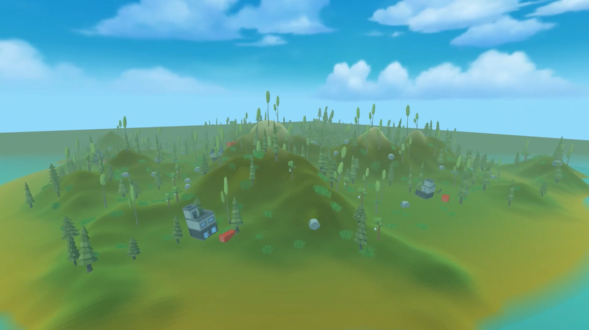
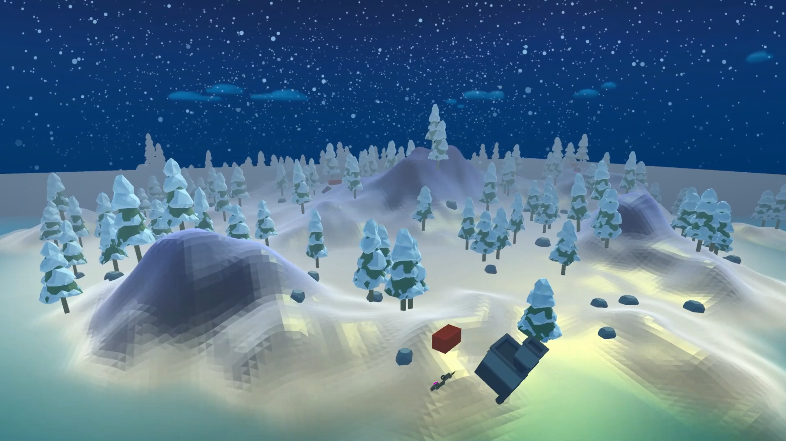
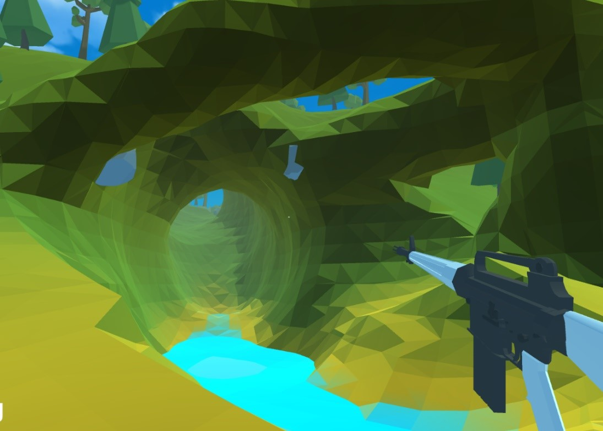
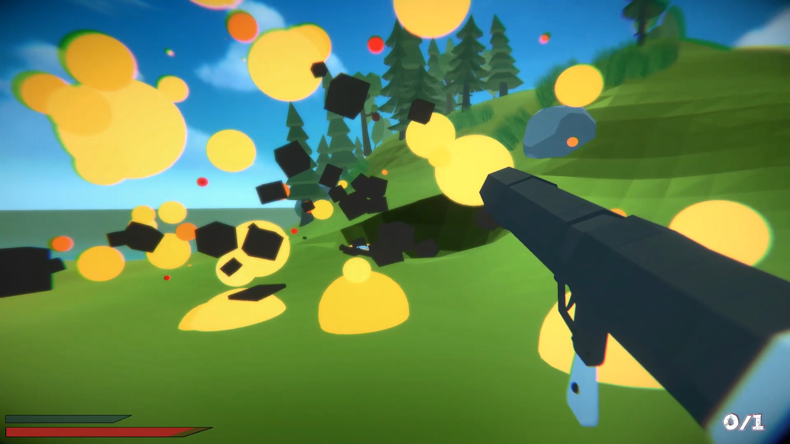

# Marching-Cubes
FPS with procedural terrain generation and editing based on Marching Cubes algorithm.
## Island generation
Terrain height is created by combining multiple procedural noise textures. Afterward, edges are flattened, and the center is lifted with a few other maps.  

   
## Editing
An island is divided into chunks, so editing simply involves changing the noise at specific points and regenerating the entire chunk. The best part is that the algorithm allows the creation and removal of terrain at any point, enabling the game to have tunnels or caves.  

 
## Credits
This project was inspired by [this video](https://www.youtube.com/watch?v=vTMEdHcKgM4).
